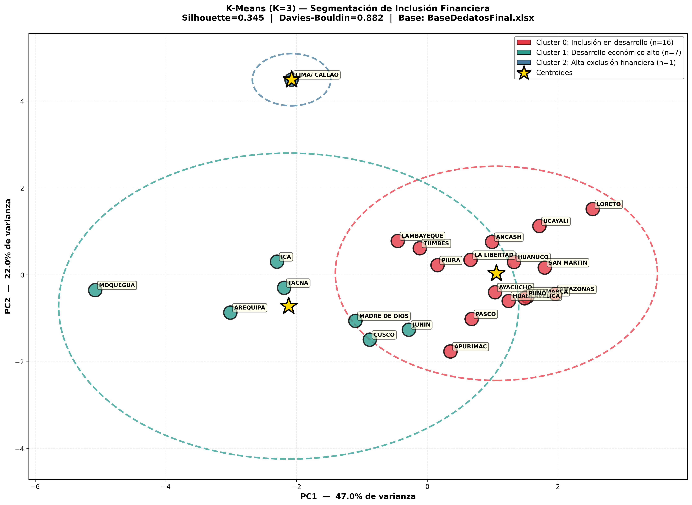

<div align="center">

# 🏦 Segmentación Territorial para Inclusión Financiera

### Machine Learning No Supervisado para la Expansión Sostenible de Servicios Financieros Formales en el Perú



**Universidad Privada del Norte**  
**Maestría en Ciencia de Datos & Inteligencia Artificial**  
**Curso: Machine Learning**  

**Versión 1.0 — Junio 2026**

---

</div>

## 📋 Descripción del Proyecto

Este proyecto aplica **5 algoritmos de Machine Learning** (PCA, Clustering Jerárquico, DBSCAN, Random Forest y K-Means) para segmentar los **24 departamentos del Perú** según su nivel de inclusión financiera, utilizando **14 variables demográficas, económicas, digitales, financieras, laborales y sociales**.

El objetivo es identificar **zonas con mejor perspectiva para el desarrollo e inclusión financiera**, proporcionando una herramienta exploratoria que oriente la expansión sostenible de **Cajas Municipales** y otros servicios financieros formales en territorios con alta informalidad económica.

## 🎯 Objetivo

Determinar los departamentos del Perú con condiciones más favorables para la expansión de servicios financieros formales, mediante técnicas de aprendizaje no supervisado que descubran patrones territoriales sin etiquetas previas.

## 👥 Participantes — Grupo N°07

| N° | Integrante | Código |
|---|---|---|
| 1 | **Abad Panta, Cristina Elizabeth** | N00558600 |
| 2 | **Arroyo Estredo, Jiang Alberto** | N00557773 |
| 3 | **Garcia Yuffra, Juan Angel** | N00563512 |
| 4 | **Mansilla Florez, Christian Serge Moises** | N00558117 |
| 5 | **Melgarejo Alcedo, Elen** | N00561314 |
| 6 | **Velarde Fernandez, Liliana** | N00554157 |

**Docente:** Dario Condor Callupe

## 🧠 Pipeline de Machine Learning

```
┌─────────────────────────────────────────────────────────────────────┐
│          PIPELINE COMPLETO — 6 FASES · 5 MODELOS                    │
├─────────────────────────────────────────────────────────────────────┤
│                                                                     │
│  [1] Carga de datos           ← BaseDedatosFinal.xlsx (24 deptos)   │
│  [2] Feature Engineering      ← 7 variables derivadas (per cápita)  │
│  [3] Estandarización          ← StandardScaler (media=0, std=1)     │
│                                                                     │
│  ┌─────────────────────────────────────────────────────────────┐   │
│  │  MODELOS                                                    │   │
│  │                                                             │   │
│  │  PCA        → Reducción dimensional + Biplot (69% varianza) │   │
│  │  Jerárquico → Dendrograma Ward (validación de K natural)    │   │
│  │  DBSCAN     → Detección de outliers por densidad (eps=2.2)  │   │
│  │  RF         → Importancia de variables (diagnóstico)        │   │
│  │  K-Means    → Segmentación final K=3 (clusters)             │   │
│  └─────────────────────────────────────────────────────────────┘   │
│                                                                     │
│  [6] Exportación          ← 8 gráficos PNG + CSV con resultados    │
│                                                                     │
└─────────────────────────────────────────────────────────────────────┘
```

## 📊 Algoritmos Implementados

| Algoritmo | Propósito | Salida |
|---|---|---|
| **PCA** | Reducir 7 dimensiones a 2 ejes para visualización | Biplot + Scree plot |
| **Clustering Jerárquico (Ward)** | Validar estructura natural de grupos | Dendrograma con corte K=3 |
| **DBSCAN** | Detectar departamentos con perfil único (outliers) | 4 outliers detectados |
| **Random Forest** | Medir qué variable predice mejor la inclusión financiera | Ranking de importancia |
| **K-Means (K=3)** | Segmentación final en grupos interpretables | 3 clusters con perfiles |

## 📁 Estructura del Repositorio

```
📂 Github/
├── 📄 BaseDedatosFinal.xlsx                    # Dataset original (24 deptos × 14 vars)
├── 📄 analisis_final_basededatos_explicado.py  # Pipeline completo de ML
├── 📄 precompute_dashboard.py                  # Precompute para dashboard interactivo
├── 📄 Machine Learning - Grupo7 - 13_Jun_26 v1.docx  # Informe del grupo
├── 📄 final_resultados_clustering.csv          # Resultados con etiquetas de cluster
│
├── 🖼️ final_01_pca_biplot.png                  # PCA: Scree plot + Biplot
├── 🖼️ final_02_dendrograma.png                 # Dendrograma jerárquico
├── 🖼️ final_03_dbscan_outliers.png             # DBSCAN: outliers y clusters
├── 🖼️ final_04_random_forest_importancia.png   # Importancia de variables (RF)
├── 🖼️ final_05_kmeans_seleccion_k.png          # Selección de K óptimo
├── 🖼️ final_06_kmeans_resultado.png            # K-Means K=3 en espacio PCA
├── 🖼️ final_07_correlacion_features.png        # Matriz de correlación
├── 🖼️ final_08_perfil_clusters.png             # Perfiles de cluster
│
└── 📄 explicacion_algoritmos_inclusion_financiera.md  # Documento explicativo
```

## 🗺️ Hallazgos Principales

Los 24 departamentos del Perú se segmentan en **3 clusters** con perfiles diferenciados:

| Cluster | Perfil | Departamentos |
|---|---|---|
| **Cluster 0** 🔴 | **Inclusión en desarrollo** — Baja densidad financiera, alta pobreza, baja conectividad | 16 departamentos (Amazonas, Cajamarca, Loreto, Puno, etc.) |
| **Cluster 1** 🟢 | **Desarrollo económico alto** — Alta densidad financiera, mayor PBI per cápita, mejor conectividad | Arequipa, Cusco, Ica, Junín, Madre de Dios, Moquegua, Tacna |
| **Cluster 2** 🔵 | **Megaurbano contradictorio** — Alto ingreso y conectividad, pero alta pobreza y baja densidad financiera per cápita | Lima/Callao (outlier) |

**4 outliers detectados por DBSCAN:** Arequipa, Lima/Callao, Madre de Dios, Moquegua

## 🔬 Variables del Modelo (7 Features)

| Variable | Descripción |
|---|---|
| `Oficinas_por_100k` | Densidad de infraestructura financiera |
| `Depositos_por_Capita` | Profundidad financiera (S/ por adulto) |
| `NBI_%_2024` | Pobreza y exclusión social |
| `Ingreso_Prom_PEN_2024` | Capacidad económica |
| `Tasa_Empleo` | Estabilidad del mercado laboral |
| `PBI_por_Capita` | Productividad económica regional |
| `Internet_por_100k` | Brecha digital |

## 📄 Licencia

Proyecto académico — Universidad Privada del Norte (UPN)  
Maestría en Ciencia de Datos & Inteligencia Artificial — 2026
